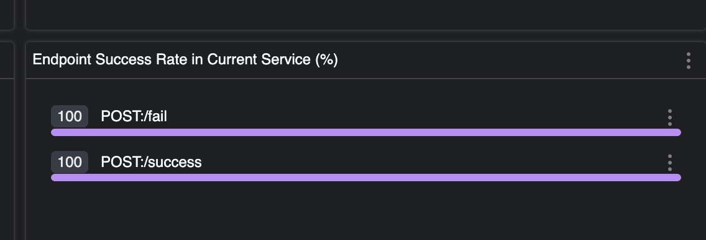

# Vert.x Skywalking Integration

## 1 Problem

The success rate is incorrect when Skywalking is working with a Vert.x web server.

This demo project comtains two api:

- 127.0.0.1:8081/success responds with http code 200
- 127.0.0.1:8081/fail responds with http code 500

In the dashboard, the success rate for both of them is 100%.



## 2 Reproduce

### 2.1 Start ES/OAP/UI/Vert.x_Web_Server

Using the following command:

```shell
wget -nc https://dlcdn.apache.org/skywalking/java-agent/9.1.0/apache-skywalking-java-agent-9.1.0.tgz &&
tar xzvf ./apache-skywalking-java-agent-9.1.0.tgz &&
./gradlew clean build && \
docker-compose build && \
export OAP_IMAGE=apache/skywalking-oap-server:9.7.0 && \
export UI_IMAGE=apache/skywalking-ui:9.7.0 && \
export ES_VERSION=7.10.2 && \
docker-compose up
```

### 2.2 Call the API

```shell
curl -v -XPOST 127.0.0.1:8081/success
curl -v -XPOST 127.0.0.1:8081/fail
```

### 2.3 Check the Dashboard

The dashboard can be accessed via:

- http://localhost:8080/

You may need to wait for a while after the api call for the data to be displayed.

